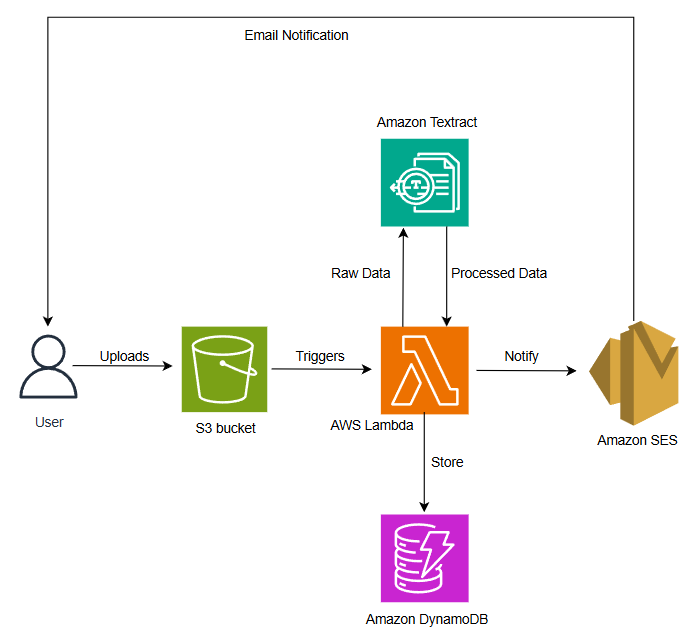
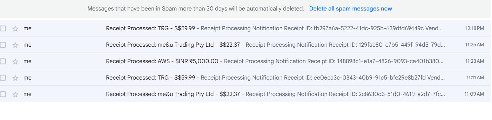
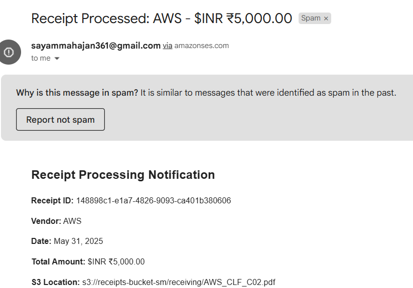

# Automated Receipt Processing System

This project is an **Automated Receipt Processing System** built using AWS Lambda, S3, Textract, DynamoDB, and SES. It automatically processes receipt images uploaded to an S3 bucket, extracts relevant data using AWS Textract, stores the results in DynamoDB, and sends an email notification with the extracted details.

---

## Features

- **Automatic Trigger:** Processes receipt images when uploaded to an S3 bucket.
- **Text Extraction:** Uses AWS Textract's `analyze_expense` for accurate receipt data extraction.
- **Data Storage:** Saves extracted data (vendor, date, total, items, etc.) to DynamoDB.
- **Email Notification:** Sends a formatted email with receipt details using AWS SES.
- **Error Handling:** Logs errors and continues execution even if email notification fails.

---

## Architecture

---

## How It Works

1. **Upload Receipt:**  
   Upload a receipt image to the configured S3 bucket.  

2. **Lambda Trigger:**  
   The Lambda function is triggered by the S3 event.

3. **Text Extraction:**  
   The function uses AWS Textract to extract fields like vendor, date, total, and line items from the receipt image.

4. **Data Storage:**  
   Extracted data is stored in DynamoDB for future reference.

5. **Email Notification:**  
   An email with the receipt details is sent to the configured recipient.  

---

## Setup & Configuration

1. **AWS Resources Needed:**
   - S3 Bucket (for receipt uploads)
   - DynamoDB Table (for storing receipt data)
   - SES (for sending emails)
   - IAM Role with permissions for S3, Textract, DynamoDB, and SES

2. **Environment Variables:**
   - `DYNAMODB_TABLE`: Name of your DynamoDB table
   - `SES_SENDER_EMAIL`: Verified SES sender email address
   - `SES_RECIPIENT_EMAIL`: Recipient email address

3. **Deploy Lambda:**
   - Upload [`lambda.py`](Automated%20Receipt%20Processing%20System/lambda.py) to your Lambda function.
   - Set the environment variables.
   - Configure the S3 bucket to trigger the Lambda on object creation.

---

## Code Overview

- [`lambda.py`](Automated%20Receipt%20Processing%20System/lambda.py):  
  Main Lambda function containing:
  - S3 event handling
  - Textract processing
  - DynamoDB storage
  - SES email notification

---

## Example Email Output

---

## Contact

For questions or support, please contact [Sayam Mahajan](mailto:mahajansayam3@gmail.com).
