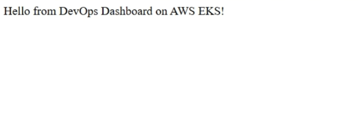
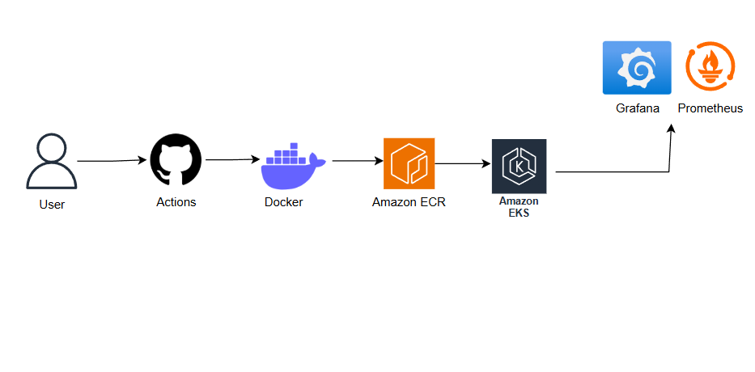
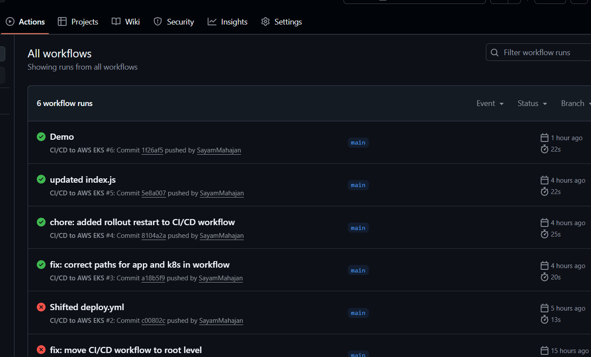
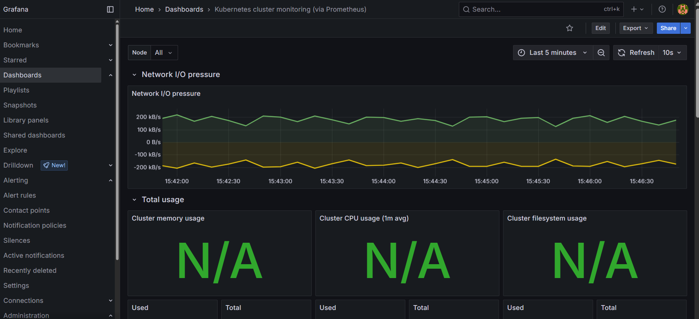

# 🚀 DevOps Dashboard on AWS with EKS, Docker, CI/CD, and Monitoring

This project demonstrates a complete DevOps pipeline built on AWS using GitHub Actions, Docker, ECR, EKS, and Prometheus-Grafana monitoring stack. Code changes automatically trigger deployment and update Kubernetes pods in real-time.

---

## 📸 Project Preview

> 

---

## 🧱 Architecture Overview

> 
> *Image: System Architecture Flow Diagram*

---

## ⚙️ Tech Stack

- **Frontend:** Node.js (Dockerized)
- **CI/CD:** GitHub Actions
- **Container Registry:** Amazon ECR
- **Container Orchestration:** Amazon EKS
- **Monitoring:** Prometheus, Grafana
- **Infrastructure:** Kubernetes YAML, Dockerfile

---

## 🚀 CI/CD Pipeline Flow

1. Code pushed to `main` branch
2. GitHub Actions workflow triggers:
   - Logs into AWS
   - Builds and pushes Docker image to ECR
   - Updates EKS kubeconfig
   - Applies Kubernetes manifests
   - Restarts pods to pull the new image

> 

---

## 🛠️ How to Deploy This Project

### ✅ Prerequisites

- AWS CLI, kubectl, eksctl installed
- AWS ECR repository created
- EKS cluster created (1 node)
- GitHub repository with secrets set:
  - `AWS_ACCESS_KEY_ID`
  - `AWS_SECRET_ACCESS_KEY`

---

### 🔧 Steps

1. Clone the repo & navigate to the project:
   git clone https://github.com/SayamMahajan/AWS_Projects.git
   cd AWS_Projects/DevOps Dashboard

2. Update ECR_REPO, EKS_CLUSTER, and AWS region in .github/workflows/deploy.yaml

3. Push to main to trigger CI/CD:
   git add .
   git commit -m "deploy: initial push"
   git push origin main

4. Verify pod rollout:
   kubectl get pods

5. Access app via LoadBalancer:
   kubectl get svc

---

### 📊 Monitoring with Grafana

1. Port forward to Grafana:
   kubectl port-forward svc/monitoring-grafana 8080:80

2. Login (admin/admin)

3. Open Kubernetes monitoring dashboard 

> 

---

### 💸 Cost Estimate

1. t3.small EKS Node: ~$0.023/hr

2. ECR Storage + Image Pulls: negligible

3. GitHub Actions (free tier): free for public repos

💡 Approx total cost if cleaned up after use: under $5 USD

---

### 📚 Learning Outcomes

1. Implemented CI/CD on AWS

2. Used EKS with real Dockerized workloads

3. Set up monitoring with Prometheus + Grafana

4. Automated deployments using GitHub Actions

5. Budget-aware usage of AWS resources